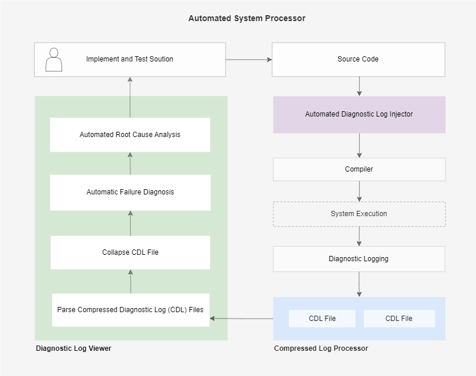

# Diagnostic Log Viewer

The Diagnostic Log Viewer (DLV) is a tool which can be used to view and interact with Compressed Diagnostic Log (CDL) files. See background for more information on [CDL files](#Background). The DLV can be used to step through the execution sequence of a program using the debug toolkit while investigating the call stack, variables and exceptions.

# Demo 

A demo of the viewer is available [here][adli-error].
* The demo CDL file was generated by injecting diagnostic logs into the [ADLI][adli-url] tool and then the log injected ADLI program was used to inject logs into [compress.py][yscope-previews] from the yscope-previews repo.
* A bug was intentionally introduced and the program was executed, generating the CDL file used in the demo.

# How does it work? 

The DLV spawns a worker to do the following: 

* Parses the header of the CDL file to extract the logtype map, variable map and the source code for each file in the program. 
* Traverses the body of the CDL file and extracts the execution sequence as well as the corresponding variables and exceptions.
* Collapses the file by extracting the stack trace for each position.
* Provides the variables, stack trace and exceptions given a position in the program. 
* Provides commands to step through the program.
* Provides the ability to set breakpoints.
* Provides the ability to enable/disable breakpoints.
* Provides the ability to play a program back from a given position (forward or backward) and to replay the program from the start.

The React application contains a CDL Provider which exposes all relevant data through contexts that can be consumed by child components. The major components in the react application are the file viewer, call stack container, variable container, breakpoint container and the debug tool kit.

# Background

> [!NOTE]  
> A more detailed introduction to diagnostic logging and the diagnostic tools it enables is in development.

CDL files are generated through a process called Diagnostic Logging (DL) in which the log type, variable values and exceptions for each statement in the program are logged. Diagnostic logging is enabled by [Automated Diagnostic Log Injector][adli-url] (ADLI) tools, which automatically insert the necessary log statements to extract the diagnostic information.

The ADLI tool uses Abstract Syntax Trees (AST's) to traverse through the structure of the program to extract variable names and insert the necessary log statements for logtypes and variables. It inserts try except statements to catch any exceptions which occured when running the program and logs it. It also inserts a log statement to inject the Simplified Syntax Tree (SST) of the program into the header of the CDL file. The SST maps every logtype and variable to a line in the program. The enables us to only log the logtype id, effectively compressing the logtypes by default.

When diagnostic logs are ingested by CLP, having a map of the variables and log types will result in improved performance and simpler implementation. It will be possible to further compress the logs by grouping variable values by name.

Using Diagnostic Logging, it will be possible to build an automated log based diagnostic solution that can perform automated root cause analysis. A simplified diagram of the diagnostic solution enabled by diagnostic logging is provided below.

# Providing feedback

You can use GitHub issues to [report a bug][bug-report] or [request a feature][feature-req].

[bug-report]: https://github.com/vishalpalaniappan/diagnostic-log-viewer/issues
[feature-req]: https://github.com/vishalpalaniappan/diagnostic-log-viewer/issues
[yscope-previews]: https://github.com/y-scope/yscope-previews/blob/main/clp-s-s3/scripts/compress.py
[demo-url]: https://vishalpalaniappan.github.io/diagnostic-log-viewer/?filePath=https://diagnostic-logs-sample.s3.us-east-2.amazonaws.com/compress.cdl
[adli-url]: https://github.com/vishalpalaniappan/asp-adli-python
[huffman-error]: https://vishalpalaniappan.github.io/diagnostic-log-viewer/?filePath=https://diagnostic-logs-sample.s3.us-east-2.amazonaws.com/huffman_compress_error_v0.clp.zst
[adli-error]: https://vishalpalaniappan.github.io/diagnostic-log-viewer/?filePath=https://diagnostic-logs-sample.s3.us-east-2.amazonaws.com/huffman_compress_error_v0.clp.zst
